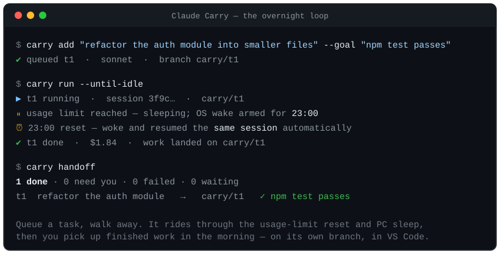
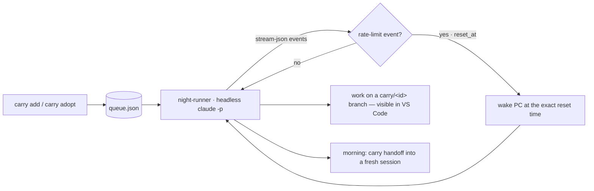

<p align="center"></p>

# Claude Carry

[](LICENSE)
[](package.json)

**Keep your Claude Code work going when you can't babysit it.** Claude Carry does two things:

1. **Queue & run unattended** — stack up tasks and let them run overnight (or whenever you're away),
   each as headless Claude Code, with lossless resume across usage-limit resets and PC sleep.
2. **Continue your *live* session after a reset** — hand off the session you're already in so it
   automatically picks up where it left off the moment your usage limit lifts — no separate run to
   reconcile in the morning.

Both ride the same engine: Claude Carry reads Claude Code's machine-readable limit events, records
each session's ID, and (on Windows) wakes the PC at the exact reset time to resume the *same*
conversation.

No framework, no VS Code extension — just a small CLI (`carry`) and a standalone runner.

## Proven in the real world

Claude Carry has already run real, non-trivial work unattended — including building an entire
project phase overnight on Opus for **~$9 of API budget**, landed on its own `carry/<id>` branch and
reviewed the next morning. The author was asleep the whole time.

## Demo



*The overnight loop: `carry add` → `carry run` → automatic resume the moment the limit resets → `carry handoff`.*

## What it is

- **`carry`** — a small CLI: `add`, `adopt`, `run`, `status`, `logs`, `approve`, `handoff`,
  `report`, `doctor`, … (the legacy `nq` command still works as an alias).
- **`queue.json`** — your task queue, a plain readable file (frozen schema v1), under `~/.claude-carry`.
- **night-runner** — a standalone supervisor that runs each task as headless Claude Code (`claude -p`),
  persists every session ID the moment it's born (so a crash mid-task is recoverable), watches
  machine-readable rate-limit events, and wakes the PC at the exact reset time.
- **Guardrails** — `dontAsk` permission mode + an allow/deny set: hard-deny for never-allowed actions
  (`git push`, reading `.env`/secrets), and "park for your approval" for anything off the allowlist.
  General Node/npm execution and mutating Git commands also park because project scripts, lifecycle
  hooks, Git hooks, and content filters can execute arbitrary code beneath an otherwise familiar command.
- **VS Code integration** — Command Palette tasks, plus three Claude Code skills (below). Work lands on
  a `carry/<id>` branch in your project's own checkout, so the run and its session are natively visible
  in Source Control and the Claude panel.

## Using it

```powershell
# queue a task to run later (defaults: Sonnet, in-folder branch)
carry add "refactor the auth module into smaller files" --goal "npm test passes"

# run the queue (foreground; Ctrl+C anytime — everything is resumable)
carry run --until-idle

# in the morning, bring last night's work into a fresh session
carry handoff
```

**Continue your current session after a reset** — run this from inside a live session while you still
have budget; when your limit resets, Claude Carry continues *this* conversation in place:

```powershell
carry adopt --session "$CLAUDE_CODE_SESSION_ID" --at +5h --continue "keep implementing the dashboard"
```

### Claude Code skills
Three skills make all of this chat-driven instead of terminal-driven (in `~/.claude/skills/`):

- **`carry-queue`** — "queue this for tonight" → enqueues a task.
- **`landing-carry-work`** — "what did Claude Carry do / what's on my plate" → surfaces the morning
  handoff and brings finished work in.
- **`continue-after-reset`** — "continue this after my limit resets" → adopts your live session.

## Why

Existing tools drive Claude's interactive terminal UI with fake keystrokes and regex-scrape the screen
to guess when usage limits reset — which breaks every time the UI wording changes. Claude Carry instead
consumes Claude Code's machine-readable surfaces: headless JSON event streams (which include the exact
limit-reset timestamp), session IDs for true resume, an in-folder branch (or an opt-in git worktree)
for isolation, and native permission modes for safety.



## Quick start

```powershell
# one-time setup: installs the standalone Claude Code CLI if missing
./setup.ps1

# health check (verifies the whole chain, incl. overnight/sleep readiness)
carry doctor
```

**Requirements:** Windows 11, Node 18+, git, a Claude Max subscription, the standalone Claude
Code CLI 2.1.139+, and at least one skill folder under `~/.claude/skills`. `carry doctor` also
checks wake timers and, on Modern Standby laptops, lid-close and AC sleep settings. Its check
count is dynamic: a ready Modern Standby Windows host currently runs seven checks, while other
platforms or a missing CLI run fewer. There are **no npm dependencies** to install. If
`git`/`node` aren't found, prepend
`C:\Program Files\Git\cmd;C:\Program Files\nodejs;` to your PATH.

## Contributing & security

See [CONTRIBUTING.md](CONTRIBUTING.md) (zero-dependency, don't weaken the guardrails) and
[SECURITY.md](SECURITY.md) (report privately; no secrets are ever committed). Changes are tracked in
[CHANGELOG.md](CHANGELOG.md). MIT licensed.

Built by Rahul Krishna.
