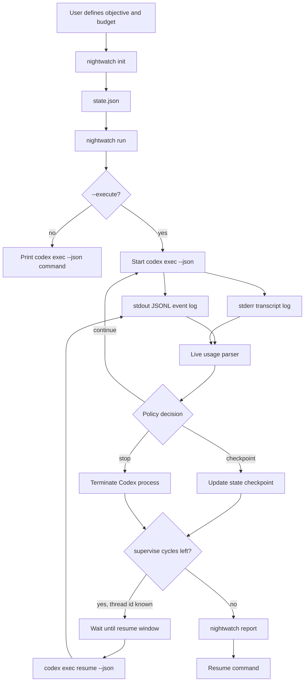
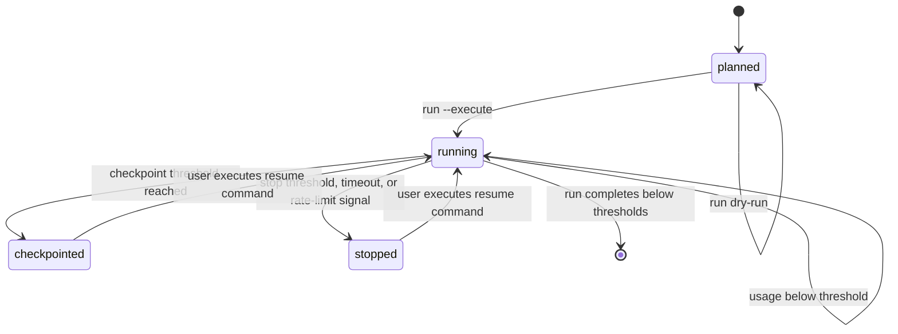

# Architecture

Codex Nightwatch is a local controller around `codex exec --json`. It does not replace Codex and does not need OpenAI credentials itself. It watches Codex's event stream, applies a local budget policy, records state, and emits a resumable report.

## Run Flow

## State Machine

## File Boundaries

- `state.json` stores objective, budget policy, status, thread id, and resume prompt.
- `events.jsonl` stores machine-readable Codex JSON events from stdout.
- `transcript.log` stores stderr and non-machine transcript output.
- `report.md` summarizes the run and prints the safest known resume command.

Keeping `events.jsonl` separate from `transcript.log` prevents a plaintext warning or rate-limit message from corrupting JSON parsing.

## Safety Defaults

- `run` prints the command by default. Execution requires `--execute`.
- `run --execute` can stop on maximum runtime, inactivity timeout, local budget policy, or rate-limit text.
- `resume-run --execute` uses `codex exec resume --json` so resumed sessions are monitored like initial runs.
- `supervise --execute` performs bounded initial/resume cycles and records every cycle under explicit log paths.
- `supervise` resumes after checkpoint decisions by default. Stop decisions are terminal unless `--resume-after-stop` is explicitly passed.
- On Windows, Nightwatch resolves a user-local Codex binary if the shell `codex` command points at a blocked WindowsApps shim.
- Resume fails closed when no thread id is known. `--allow-last` is an explicit opt-in.
- Obvious unattended danger flags such as `danger-full-access` are refused.
- Reports can redact prompts, local paths, and thread ids before sharing.
- Token totals are advisory and local. They are not a billing statement.
