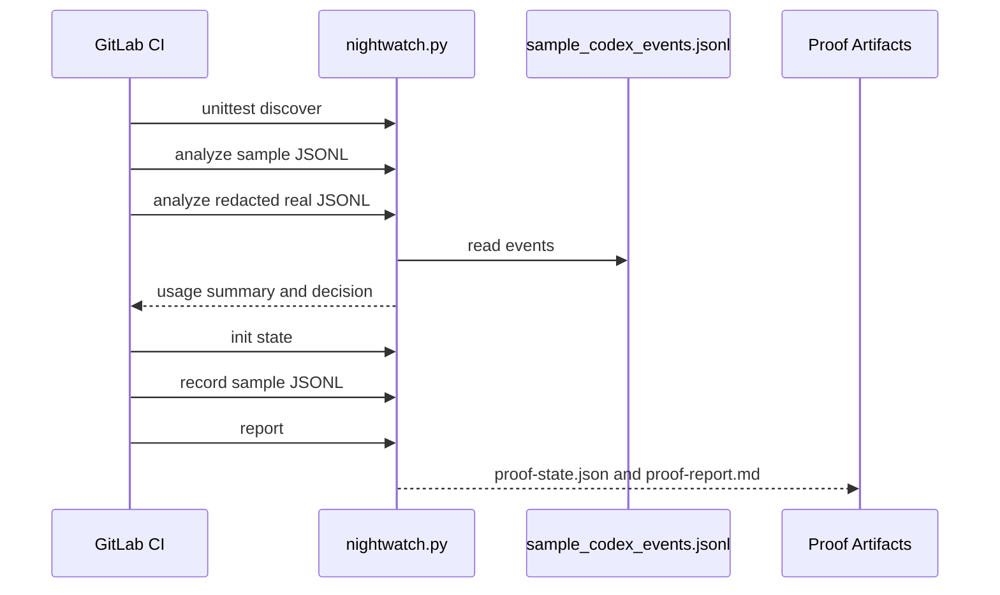
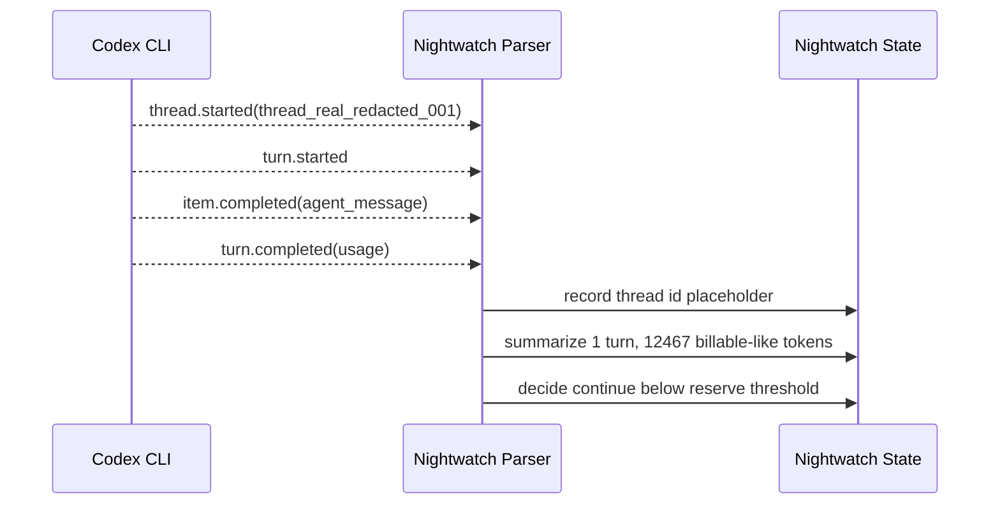

# Public Proof Plan

The public proof should demonstrate that Codex Nightwatch does real, reproducible work without asking viewers to trust a private overnight run.

## What To Prove

1. It can parse Codex JSONL events.
2. It can make deterministic budget decisions.
3. It records checkpoint/resume state.
4. It generates a report with a safe resume command.
5. Its safety defaults prevent accidental broad unattended execution.

## Current Proof Artifacts

- `tests/sample_codex_events.jsonl` is a small representative Codex event stream.
- `tests/fixtures/real_codex_minimal.redacted.jsonl` is a real Codex JSONL event stream captured on July 6, 2026 and redacted before tracking.
- `tests/fixtures/rate_limit_error.jsonl` and `tests/fixtures/missing_usage.jsonl` cover edge behavior.
- `tests/test_nightwatch.py` verifies parsing, policy decisions, checkpoint idempotency, fail-closed resume, unsafe-flag blocking, report redaction, fixture handling, and monitored subprocess behavior.
- `.gitlab-ci.yml` runs the tests and creates a proof report artifact from the sample stream. It also analyzes the redacted real fixture.

## CI Proof Flow

## Redacted Real Fixture Timeline

This is the tracked event shape from `tests/fixtures/real_codex_minimal.redacted.jsonl`.

## Before Going Public

- Add screenshots or copied CI artifact snippets showing the proof report after private CI passes.
- Add a short demo GIF or terminal recording once the CLI shape stabilizes.
- Decide whether public distribution is a Python package, npm wrapper, Codex plugin, or all three.

## Public README Claim To Avoid

Do not claim that Nightwatch can see private ChatGPT subscription limits exactly. The honest claim is narrower:

> Nightwatch observes local Codex JSONL usage events and applies user-defined local thresholds so unattended runs can checkpoint, stop, and resume more predictably.
